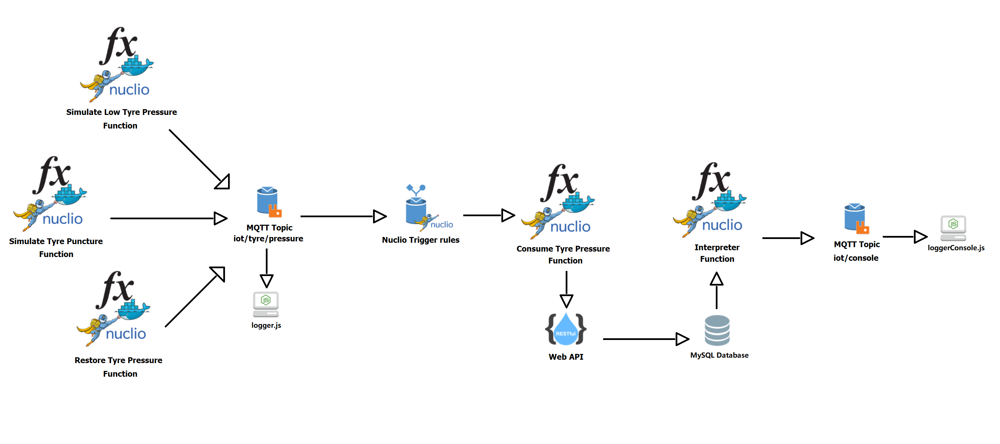

# SCIoT Project

**Project name**: Tyre Pressure Detection
<br>
**Student name**: Michele Delli Paoli
<br>
**Student ID**: 0522500797
<br>
<br>

### Description


##### 1) Application Goal
The system allows to **monitor** the pressure of a car's tyre in order to **alert** the driver:
* in case a **tyre puncture** occurs;
* just to report **low tyre pressure**.

<br>

##### 2) Scenario
The system elaborates data recorded by a simulated sensor and **sends** to the **console** a specific **message**, which will be:
1. "**Low tyre pressure registered!**": if the recorded pressure is lower than the standard one;
2. "**Tyre pressure restored!**": if the sensor records a pressure greater or equals than the standard one, while the previously recorded pressure was lower than the standard one.
3. "**Optimal tyre pressure!**": if the sensor records a pressure greater or equals than the standard one, and the previously recorded pressure was greater or equals than the standard one too.
4. "**Warning, possible tyre puncture!**": if the sensor records a continuous drop in pressure during a small period of time. <br>
More specifically, to simulate a tyre puncture, we will suppose to record **5 tyre pressure decreasing values** in a period of time of **1 minute**.

<br>

##### 3) Architecture
The system is composed by:
* several **functions** in Node.js;
* two **loggers**;
* a **MySQL Databse**.

<br>

###### Functions

* **Simulate Low Tyre Pressure**: it simulates a **drop** in tyre pressure by sending a message to the topic "iot/tyre/pressure" with a pressure value **lower** than the standard one.


* **Simulate Tyre Puncture**: it simulates a **puncture** by sending **5 decreasing pressure messages** to the topic "iot/tyre/pressure".<br>
Note: each of these 5 pressure value is lower than the one recorded before and always lower than the standard value one.

* **Restore Tyre Pressure**: it simulates the act of **inflating** the tyre by sending a message to the topic "iot/tyre/pressure" with a pressure value **greater or equals** than the standard one.


* **Consume Tyre Pressure**: it is triggered by an incoming message on the topic  "iot/tyre/pressure", and **insert** into a Relational Database a record composed by the **pressure value** and the associated **timestamp**.


* **Interpreter**: a function which **retrieves** the **last 5 records** from the Database and **interprets** the **data**.<br>
More specifically:
    * if timestamps **fit** into a period of time of **1 minute** and the pressure values are **sorted** in **decreasing order** by the timestamps, then the function will send a message to the topic "**iot/console**" reporting: "**Warning, possible tyre puncture!**"; 
    
    * if timestamps **don't fit** into a period of time of **1 minute** and the **last pressure value** is **lower** than the standard one, then the function will send a message to the topic "**iot/console**" reporting: "**Low tyre pressure registered!**";
    
    * if pressure values are **not sorted** in **decreasing order** by the timestamps, and the **last pressure value** is **lower** than the standard one, then the function will send a message to the topic "**iot/console**" reporting: "**Low tyre pressure registered!**";
    
    * if the **second-last pressure value** is **lower** than the standard one, while the **last pressure value** is **greater** or **equals** to the standard one, the function will send a message to topic "**iot/console**" reporting: "**Tyre pressure restored!**".
    
    * if the **second-last pressure value** is **greater** or **equals** to the standard one, and the **last pressure value** **greater** or **equals** to the standard one too, the function will send a message to topic "**iot/console**" reporting: "**Tyre pressure optimal!**".

<br>

###### Loggers
* **logger.js**: it logs incoming messages on the topic "**iot/tyre/pressure**".

* **loggerConsole.js**: it logs incoming messages on the topic "**iot/console**".

<br>

###### MySQL Database:
* **MySQL Instance**: a single Table which is composed by three columns: **id**, **pressure**, **timestamp**.

<br>


*Figure 1: System Architecture.*

<br>
<br>

##### 4) Setup
To run the system, you must install the following components:

* **Docker**: it is a Containerization platform which allows you to package, deploy and run portable applications with ease. <br>
To install Docker, execute the following commands:
    ````shell
    sudo apt-get update
    sudo apt-get install \ apt-transport-https \ ca-certificates \ curl \ software-properties-common
    curl -fsSL https://download.docker.com/linux/ubuntu/gpg | sudo apt-key add –
    sudo apt-key fingerprint 0EBFCD88
    sudo add-apt-repository \"deb [arch=amd64] https://download.docker.com/linux/ubuntu \$(lsb_release -cs) \ stable"
    sudo apt-get update
    sudo apt-get install docker-ce
    sudo ln -sf /run/systemd/resolve/resolv.conf /etc/resolv.conf
    ````

<br>

* **Docker Compose**: it is a tool useful to configure multiple components of a  Microservices Architecture by using a single YAML file.<br>
To install Docker Compose, execute the following commands:
    ````shell
    sudo curl -L "https://github.com/docker/compose/releases/download/1.22.0/docker-compose-$(uname -s)-$(uname -m)" -o /usr/local/bin/docker-compose
    sudo chmod +x /usr/local/bin/docker-compose

    ````
<br>

* **Node.js**: it is a JavaScript runtime useful to execute back-end code.<br>
To install Node.js, execute the following command:
    ````shell
   sudo apt install nodejs
    ````
    
<br>


* **Nuclio**: it enables you to **run a function** when an event is triggered. <br> 
It will be executed on a Docker Container.

* **RabbitMQ**: it is a **message broker** useful to post messages on topics, by using either MQTT and AMQP protocol.<br> 
It will be executed on a Docker Container.

* **MySQL**: it provides a **Relational Database instance** in which we will **store** our recorded ***pressure values*** with their corresponding ***timestamp***, in order to gather and process them.<br>
It will be executed on a Docker Container.

<br>
<br>

##### 5) Build in Docker
To build the system on Docker Containers, you must execute the folliwng steps. 
<br>

1. Run MySQL on a Docker Container named "**mysqldb**" by executing the following command:
    ```shell
    docker run --name mysqldb -p 33060:3306 -e MYSQL_ROOT_PASSWORD=1234 -d mysql:latest
    ```

2. Enter the MySQL shell by executing the following command:
    ```shell
    docker exec -it mysqldb mysql -u root -p
    ```

3. You will be asked to enter the **password** associated with the MySQL root account which you've typed in the previously "docker run" command, so type it and press enter.


4. Create a Database called "**sciot_project**" by executing the following command:
    ````shell
    mysql> CREATE DATABASE sciot_project;
    ````

5. Create a Table called "**tyre_pressure_detection**" inside the "**sciot_project**" Database, by executing the following commands:    
    ````shell
    mysql> USE sciot_project;
    mysql> CREATE TABLE tyre_pressure(id int(11) NOT NULL AUTO_INCREMENT, pressure varchar(45) NOT NULL, timestamp varchar(100) NOT NULL,  PRIMARY KEY (id));
    
    ````
    
6. In order to avoid a MySQL error version, configure the password for the root account by executing the following commands:
    ````shell
    mysql> ALTER USER 'root' IDENTIFIED WITH mysql_native_password BY '1234';
    mysql> FLUSH PRIVILEGES;
    ````

7. Exit the MySQL shell by executing the following command:
    ````shell
    mysql> exit
    ````
    
    
<br>

8. Run Nuclio on Docker by executing the following command:
    ```shell
    docker run --name nuclio-dashboard -p 8070:8070 -d -v /var/run/docker.sock:/var/run/docker.sock -v /tmp:/tmp nuclio/dashboard:stable-amd64
    ```

9. Open your Browser and type into the Address bar the following URL to visualize the Nuclio Dashboard:
    ```shell
    localhost:8070
    ```
    
10. Create a Docker network named "**project-network**" and add the "**mysqldb**" Container and the "**nuclio-dashboard**" Container, in order to enable the communication.
    ````shell
    docker network create project-network
    docker network connect project-network mysqldb
    docker network connect project-network nuclio-dashboard
    ````
    
<br>

11. Run RabbitMQ on Docker by executing the following command:
    ```shell
    docker run --name rabbit-dashboard -p 9000:15672 -d -p 1883:1883 -p 5672:5672 cyrilix/rabbitmq-mqtt
    ```
    
<br>

12. Check your local IP Address by executing the following command (only on Linux):
    ```shell
    hostname -I
    ```

<br>

13. On the Nuclio Dashboard, click on the "**Create project**" button.
14. Fill the form to create a New Project, then click on the "**Create**" button.
15. Click on the Project you've just created to open it.

<br>

16. Click on the "**Create Function**" button to create a new function.
17. Click on the "**Import**" option above, and then on the "Import" button below.
18. Select the ***mqtt_consume_tyre_pressure*** YAML file to import the "**Consume Tyre Pressure**" function.
19. Click on the "**Create Function**" button.
20. Edit the "**Consume Tyre Pressure**" function by replacing the **[localIpAddress]** parameter at line 6 with the String value of your local Ip Address you've checked in the previous step: 
    ````shell
    6   var DATABASE_HOST = "localDatabaseHost";
    ````

21. Edit the "Consume Tyre Pressure" function by replacing the **[localIpAddress]** parameter at line 18 with your local IP Address:
    ```shell
    18       amqp.connect('amqp://guest:guest@[localIpAddress]:5672').then(function(conn) {
    ```
22. Go to the "**Triggers**" section above, click on the '**>**' symbol to open the "**myMqttTrigger**" trigger form, then edit the "**URL**" element by replacing the **[localIpAddress]** parameter with your local IP Address:
    ```shell
    URL
    guest:guest@[localIpAddress]:1883
    ```
23. Click the "**Deploy**" button to deploy the function.

<br>

24. Click on the "**Create Function**" button to create a new function.
25. Click on the "**Import**" option above, and then on the "Import" button below.
26. Select the ***mqtt_interpreter*** YAML file to import the "**Interpreter**" function.
27. Click on the "**Create Function**" button.
28. Edit the "**Interpreter**" function by replacing the **[localIpAddress]** parameter at line 6 with the String value of your local Ip Address: 
    ````shell
    6   var DATABASE_HOST = [localIpAddress];
    ````

29. Edit the "**Interpreter**" function by replacing the **[localIpAddress]** parameter with your local IP Address in the 128-th line of code:
    ```shell
    128       amqp.connect('amqp://guest:guest@[localIpAddress]:5672').then(function(conn) {
    ```
30. Go to the "**Triggers**" section above, click on the '**>**' symbol to open the "**myMqttTrigger**" trigger form, then edit the "**URL**" element by replacing the **[localIpAddress]** parameter with your local IP Address:
    ```shell
    URL
    guest:guest@[localIpAddress]:1883
    ```
31. Click the "**Deploy**" button to deploy the function.

<br>

32. Click on the "**Create Function**" button to create a new function.
33. Click on the "**Import**" option above, and then on the "Import" button below.
34. Select the ***mqtt_simulate_low_tyre_pressure*** YAML file to import the "**Simulate Low Tyre Pressure**" function.
35. Click on the "**Create Function**" button.
36. Edit the "**Simulate Low Tyre Pressure**" function by replacing the **[localIpAddress]** parameter at line 2 with your local IP Address:
    ```shell
    2   var mqtt_url = url.parse(process.env.CLOUDAMQP_MQTT_URL || 'mqtt://guest:guest@[localIpAddress]:1883');
    ```

37. Click the "**Deploy**" button to deploy the function.

<br>

38. Click on the "**Create Function**" button to create a new function.
39. Click on the "**Import**" option above, and then on the "Import" button below.
40. Select the ***mqtt_simulate_tyre_puncture*** YAML file to import the "**Simulate Tyre Puncture**" function.
41. Click on the "**Create Function**" button.
42. Edit the **"Simulate Tyre Puncture**" function by replacing the **[localIpAddress]** parameter at line 2 with your local IP Address:
    ```shell
    2   var mqtt_url = url.parse(process.env.CLOUDAMQP_MQTT_URL || 'mqtt://guest:guest@[localIpAddress]:1883');
    ```

43. Click the "**Deploy**" button to deploy the function.

<br>

44. Click on the "**Create Function**" button to create a new function.
45. Click on the "**Import**" option above, and then on the "Import" button below.
46. Select the ***mqtt_restore_tyre_pressure*** YAML file to import the "**Restore Tyre Pressure**" function.
47. Click on the "**Create Function**" button.
48. Edit the "**Restore Tyre Pressure**" function by replacing the **[localIpAddress]** parameter at line 2 with your local IP Address:
    ```shell
    2   var mqtt_url = url.parse(process.env.CLOUDAMQP_MQTT_URL || 'mqtt://guest:guest@[localIpAddress]:1883');
    ```

49. Click the "**Deploy**" button to deploy the function.

<br>
<br>

#### 6) Run the system
Run the system by following the next steps. 

1. Go to the project folder, open the terminal and then run the **logger.js** by executing the following command:
    ````shell
    node logger.js
    ````

2. Go to the project folder, open another terminal and then run the **loggerConsole.js** by executing the following command:
    ````shell
    node loggerConsole.js
    ````
    
<br>

3. Go to the "**Simulate Low Tyre Pressure**" function into the Nuclio Dashboard, then click on the "**Test**" button on the right.

4. The "**Simulate Low Tyre Pressure**" function will **generate** a random pressure value which is lower than the standard one (3000), and it will **post** a message on the "**iot/tyre/pressure**" topic.<br>
The "**Consume Tyre Pressure**" function will be **triggered** by the incoming message on the "**iot/tyre/pressure**" topic and will execute a **query** in order to **insert** the *pressure value* and its corresponding *timestamp* into the Database.<br>
The "**Interpreter**" function will be **triggered** too by the incoming message on the "**iot/tyre/pressure**" topic, it will execute a **query** in order to **get** the **last 5 records** from the Database and it will interpret the data by **posting** a message on the "**iot/console**" topic.


5. Go to the terminal in which you've executed the **logger.js**, and you will see something like this:
    ````terminal
    C:\Users\Michele Delli Paoli\Desktop\TyrePressureDetection>node logger.js
    [*] Waiting for messages. To exit press CTRL+C
    [x] Received 'Function 'mqtt_consume_tyre_pressure' has been triggered by the following message received on topic 'iot/tyre/pressure': 2906-Mon Dec 05 2022 18:12:56 GMT+0000 (UTC)'
    
    ````
6. Go to the terminal in which you've executed the **loggerConsole.js**, and you will see something like this:
    ````terminal
    C:\Users\Michele Delli Paoli\Desktop\TyrePressureDetection>node loggerConsole.js
    [*] Waiting for messages. To exit press CTRL+C
    [x] Received 'Low Tyre Pressure registered!'
    
    ````

<br>

7. Go to the "**Simulate Tyre Puncture**" function into the Nuclio Dashboard, then click on the "**Test**" button on the right.

8. The "**Simulate Tyre Puncture**" function will **generate** 5 random pressure values in decreasing order which are all lower than the standard one (3000), and it will **post** 5 consecutive messages on the "**iot/tyre/pressure**" topic.<br>
The "**Consume Tyre Pressure**" function will be **triggered** by each of the incoming messages on the "**iot/tyre/pressure**" topic and will execute a **query** for each message in order to **insert** each *pressure value* and its corresponding *timestamp* into the Database.<br>
The "**Interpreter**" function will be **triggered** too by each incoming message on the "**iot/tyre/pressure**" topic, and for each incoming messagge it will execute a **query** in order to **get** the **last 5 records** from the Database and it will interpret the data by **posting** a message on the "**iot/console**" topic.


9. Go to the terminal in which you've executed the **logger.js**, and you will see something like this:
    ````terminal
    C:\Users\Michele Delli Paoli\Desktop\TyrePressureDetection>node logger.js
    [*] Waiting for messages. To exit press CTRL+C
    [x] Received 'Function 'mqtt_consume_tyre_pressure' has been triggered by the following message received on topic 'iot/tyre/pressure': 2418-Mon Dec 05 2022 18:59:21 GMT+0000 (UTC)'
    [x] Received 'Function 'mqtt_consume_tyre_pressure' has been triggered by the following message received on topic 'iot/tyre/pressure': 1479-Mon Dec 05 2022 18:59:26 GMT+0000 (UTC)'
    [x] Received 'Function 'mqtt_consume_tyre_pressure' has been triggered by the following message received on topic 'iot/tyre/pressure': 1274-Mon Dec 05 2022 18:59:30 GMT+0000 (UTC)'
    [x] Received 'Function 'mqtt_consume_tyre_pressure' has been triggered by the following message received on topic 'iot/tyre/pressure': 2094-Mon Dec 05 2022 18:59:24 GMT+0000 (UTC)'
    [x] Received 'Function 'mqtt_consume_tyre_pressure' has been triggered by the following message received on topic 'iot/tyre/pressure': 2044-Mon Dec 05 2022 18:59:25 GMT+0000 (UTC)'
    
    ````
10. Go to the terminal in which you've executed the **loggerConsole.js**, and you will see something like this:
    ````terminal
    C:\Users\Michele Delli Paoli\Desktop\TyrePressureDetection>node loggerConsole.js
    [*] Waiting for messages. To exit press CTRL+C
    [x] Received 'Warning, possible tyre puncture!'
    [x] Received 'Warning, possible tyre puncture!'
    [x] Received 'Warning, possible tyre puncture!'
    [x] Received 'Warning, possible tyre puncture!'
    [x] Received 'Warning, possible tyre puncture!'
    
    ````

<br>

11. Go to the "**Restore Tyre Pressure**" function into the Nuclio Dashboard, then click on the "**Test**" button on the right.

12. The "**Restore Tyre Pressure**" function will **generate** a random pressure value which is **greater or equals** than the standard one (3000), and it will **post** a message on the "**iot/tyre/pressure**" topic.<br>
The "**Consume Tyre Pressure**" function will be **triggered** by the incoming message on the "**iot/tyre/pressure**" topic and will execute a **query** in order to **insert** the *pressure value* and its corresponding *timestamp* into the Database.<br>
The "**Interpreter**" function will be **triggered** too by the incoming message on the "**iot/tyre/pressure**" topic, and it will execute a **query** in order to **get** the **last 5 records** from the Database and it will interpret the data by **posting** a message on the "**iot/console**" topic.


13. Go to the terminal in which you've executed the **logger.js**, and you will see something like this:
    ````terminal
    C:\Users\Michele Delli Paoli\Desktop\TyrePressureDetection>node logger.js
    [*] Waiting for messages. To exit press CTRL+C
    [x] Received 'Function 'mqtt_consume_tyre_pressure' has been triggered by the following message received on topic 'iot/tyre/pressure': 3027-Mon Dec 05 2022 19:09:15 GMT+0000 (UTC)'
    
    ````
14. Go to the terminal in which you've executed the **loggerConsole.js**, and you will see something like this:
    ````terminal
    C:\Users\Michele Delli Paoli\Desktop\TyrePressureDetection>node loggerConsole.js
    [*] Waiting for messages. To exit press CTRL+C
    [x] Received 'Tyre Pressure restored!'
    
    ````

<br>

15. Now, if you go back the "**Restore Tyre Pressure**" function into the Nuclio Dashboard, and then click on the "**Test**" button on the right, you will have something like this in the terminal in which you've executed the **loggerConsole.js**:
    ````terminal
    C:\Users\Michele Delli Paoli\Desktop\TyrePressureDetection>node loggerConsole.js
    [*] Waiting for messages. To exit press CTRL+C
    [x] Received 'Tyre Pressure restored!'
    [x] Received 'Tyre Pressure optimal!'
    
    ````


